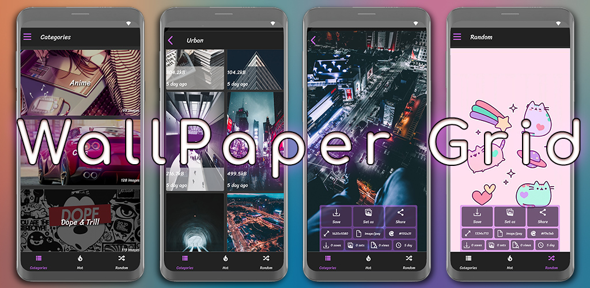

# Wallpaper Grid | Mobile App, API, Web-scraper
A Full-Stack wallpaper provider app with web-scraping

*App Creation Date: June 2020*

In 2020 I was looking for a new monetizable app idea and came across the concept of wallpaper distribution apps. These apps poised the interesting challenge of collecting public domain images, creating metadata around them, and providing them to the user. 
I achieved this with a combination of a NodeJS web-scraper, a LEMN stack server, and my React Native front-end. 

## Sourcing Images 🖼️
The first step was to source images which would be displayed in the app. To do this, I wrote a web-scraper in NodeJS which would collect images from various sources, normalize their metadata, and store them on the server, with their references and data in an accompanying MySQL database. While I gathered as much data as I could on the photos, a priority was their height, width, and averaged color (the most prevalent color in the image); Gathering these allowed me to display a unique placeholder for the image while it loads from the server.
The scraping script is to be run daily via a CRON job to make new wallpapers available.

## LEMN Server 🍋
This project was backed by my Linux Nginx MySQL Express server running on a Digital Ocean VPS. The web-scraper would input data into the MySQL DB, which would then be presented to the users via the Express API. The API boasted a combination of 7 GET and POST endpoints, and was used to not only serve the wallpapers and their metadata, but to track the view and download counts. This enabled me to display a "Hot"/"Trending" section, as well as track what wallpapers were doing well, so I could obtain more of them in the future.

## Frontend 📱
The mobile application was built with React Native, and featured three main screens: Categories, Hot, and Random.
Categories is a stack navigator allowing the user to browse different genres of wallpaper, Hot displayed the most viewed and downloaded wallpapers, and random was a "Pull-to-refresh" screen, showing a random wallpaper from the server.
Users would see a bottom banner ad served by Admob, and after downloading a wallpaper would be shown an interstitial ad.

## Current State ⌚️
I have removed the app from the app-store, as I moved from a VPS setup to a serverless setup on Firebase. While I could have migrated the app's API, I decided I did not want to allot the mental bandwidth to it anymore, and landed on retiring the project.

## Like my work?

